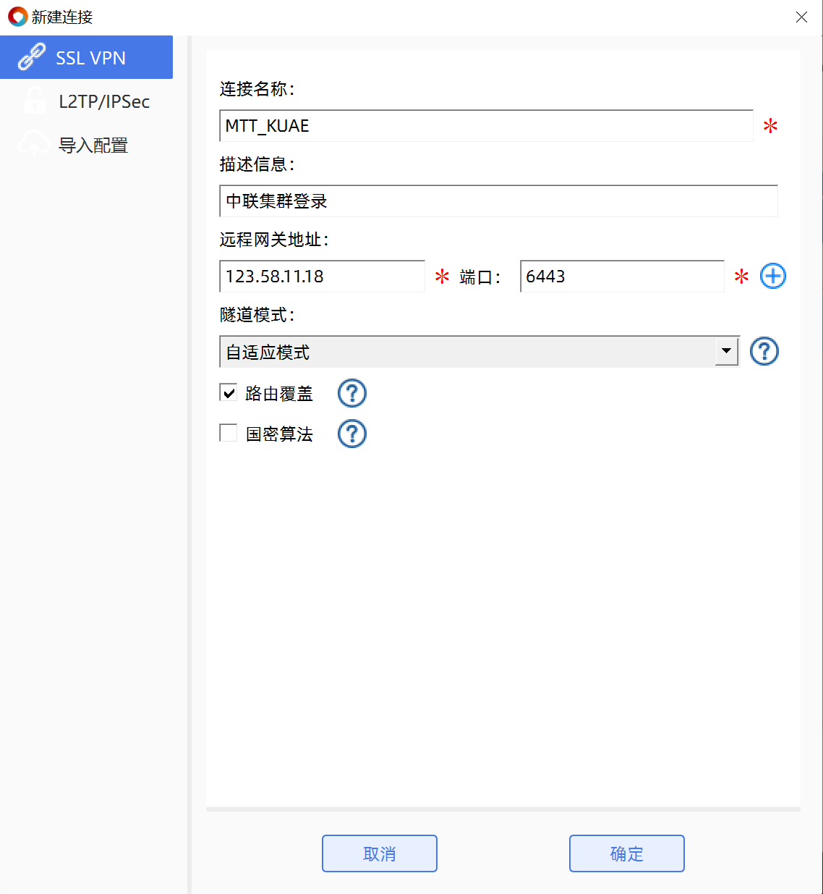

# 登录KUAE集群

> MT-GPU集群（[MTT KUAE](https://www.mthreads.com/product/KUAE)），提供给用户体验和测试

1. 下载UniVPN:
    
     [UniVPN Client 远程接入终端方案](https://www.leagsoft.com/doc/article/103107.html)
    
2. 登陆中联VPN
    1. 步骤一: 点击”`+新建连接`”:
        1. 连接名称: 自定义
        2. 远程网管地址: `123.58.11.18`
        3. 端口: `6443`
        4. 点击”`确定`” 返回
        
    2. 连接中联VPN
        1. 点击创建的连接
        2. 点击”`连接`”, 跳出跳窗, 输入用户名密码
            1. 用户名: `mtgpucust`
            2. 密码: `Try@ndb22!`
        3. 弹窗提示登录成功
3. 登陆光环VPN，和中联的VPN方法类似，可参考上图
    1. 步骤一: 点击”`+新建连接`”:
        1. 连接名称: 自定义
        2. 远程网管地址: `119.254.198.2`
        3. 端口: `6443`
        4. 点击”`确定`” 返回
    2. 连接中联VPN
        1. 点击创建的连接
        2. 点击”`连接`”, 跳出跳窗, 输入用户名密码
            1. 用户名: `user`
            2. 密码: `Admin@12345`
        3. 弹窗提示登录成功
        
4. 登录机器
    
    `ssh mccxadmin@<NODE_IP> -P <password>`
> 若不清楚具体的机器及登录方式请联系相关工作人员